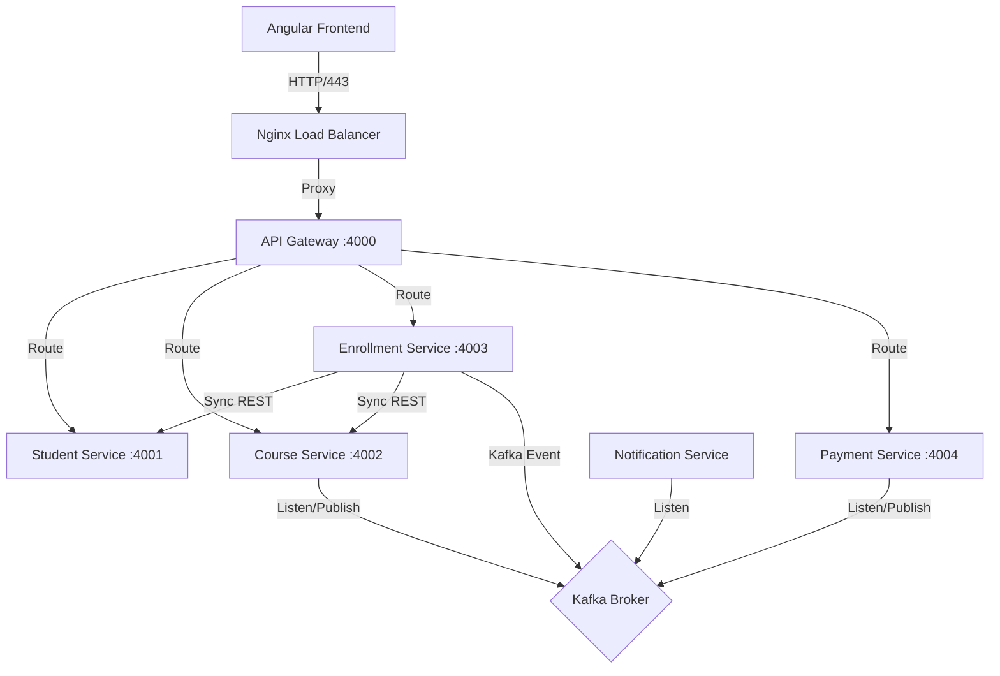

# Student Management System - Comprehensive Technical Documentation

## 1. System Architecture Overview

This project is a **Microservices-based Student Management System** built with a **Spring Boot** backend and an **Angular** frontend. It utilizes a **distributed architecture** where services communicate synchronously via REST (Service Discovery) and asynchronously via Kafka (Event-Driven Saga Pattern).

### 1.1 Core Architecture Diagram


---

## 2. Microservices Detail (Backend)

### 2.1 Enrollment Service (Orchestrator)
**Port:** `4003` (Internal), `8083` (Debug)
**Role:** Manages the student enrollment lifecycle and orchestrates the distributed transaction (Saga).

#### Key Classes & Methods:
*   **`EnrollmentService.java`**:
    *   `enrollStudent(request)`: Initiates the Saga.
        1.  Validates `studentId` and `courseId` via Feign Clients.
        2.  Saves `Enrollment` entity with status `PENDING`.
        3.  Publishes `EnrollmentInitiatedEvent` to Kafka topic `enrollment-initiated`.
    *   `handleSeatReserved(event)`: Final Success Handler.
        *   Listens to `seat-reserved` topic.
        *   Updates Enrollment Status to `CONFIRMED`.
    *   `handleSagaFailure(event)`: Compensation Handler.
        *   Listens to `payment-failed` or `seat-reservation-failed`.
        *   Updates Enrollment Status to `CANCELLED`.
*   **`EnrollmentController.java`**:
    *   `POST /enrollments`: Calls `enrollStudent`.
    *   `POST /enrollments/{id}/retry`: Manually re-triggers the Saga event for stuck enrollments.

### 2.2 Payment Service
**Port:** `4004`
**Role:** Handles financial transactions.

#### Key Classes & Methods:
*   **`PaymentService.java`**:
    *   `processPayment(event)` (**Listener**):
        *   Triggered by `enrollment-initiated`.
        *   Creates a `Payment` record with status `PENDING`.
        *   *Simulates a payment pause waiting for user input.*
    *   `completePayment(id)`:
        *   Updates status to `PAID`.
        *   Publishes `payment-success` event to Kafka.
    *   `handleSeatReservationFailure(event)` (**Rollback**):
        *   If the course turns out to be full *after* payment, this listener processes a refund.

### 2.3 Course Service
**Port:** `4002`
**Role:** Manages course catalog and inventory.

#### Key Classes & Methods:
*   **`CourseService.java`**:
    *   `reserveSeat(event)`:
        *   Triggered by `payment-success`.
        *   Checks `availableSeats > 0`.
        *   If YES: Decrements seat count, saves, publishes `seat-reserved`.
        *   If NO: Publishes `seat-reservation-failed` (triggering a refund in Payment Service).

### 2.4 Student Service
**Port:** `4001`
**Role:** CRUD for Student Profiles.

#### Key Classes & Methods:
*   **`StudentController.java`**: Standard REST endpoints (`GET`, `POST`, `PUT`, `DELETE`).
*   **`StudentService.java`**:
    *   Publishes `StudentEvent` (CREATED/UPDATED) to Kafka.
    *   The Notification Service listens to this to send "Welcome" emails.

### 2.5 Notification Service
**Port:** `4006`
**Role:** Sends emails based on system events.

#### Key Classes & Methods:
*   **`NotificationListener.java`**:
    *   `handleStudentEvent(event)`: Sends generic welcome email on registration.
    *   `handleEnrollmentEvent(event)`: Sends detailed confirmation email with course name and dates upon `CONFIRMED` status.

---

## 3. Frontend Architecture (Angular)

### 3.1 Services (`src/app/services/`)
We use **Angular Signals** for state management.

*   **`EnrollmentService.ts`**:
    *   `enrollStudent(req)`: POST request. *Crucial:* Handles `CANCELLED` status logic.
    *   `enrollmentsSignal`: A reactive signal containing the up-to-date list of enrollments.
*   **`PaymentService.ts`**:
    *   `completePayment(id)`: Used in the UI to confirm the "Mock" payment.

### 3.2 Components
*   **`EnrollmentFormComponent`**:
    *   Validates User Input.
    *   Displays explicit error messages if the Saga returns a `CANCELLED` status (e.g., if the Course Service was down).

---

## 4. Deployment Configuration

### 4.1 Docker Compose (`docker-compose.yml`)
Specific memory tuning has been applied for AWS t2.small instances:
```yaml
environment:
  JAVA_TOOL_OPTIONS: "-Xms128m -Xmx180m"
```
This prevents the JVM from consuming all available RAM, which previously caused OOM (Out of Memory) crashes.

### 4.2 Nginx Configuration
*   **Backend Nginx**: Routes `/api/*` requests to the Internal API Gateway (`api-gateway:4000`).
*   **Frontend Nginx**: Serves the Single Page Application (SPA), redirecting 404s to `index.html`.

---

## 5. Deployment Commands
To deploy or update on EC2:

1.  **Pull Changes**:
    ```bash
    git pull origin main
    ```
2.  **Rebuild Services**:
    ```bash
    docker-compose up -d --build
    ```
3.  **Check Logs**:
    ```bash
    docker-compose logs -f enrollment-service
    ```

