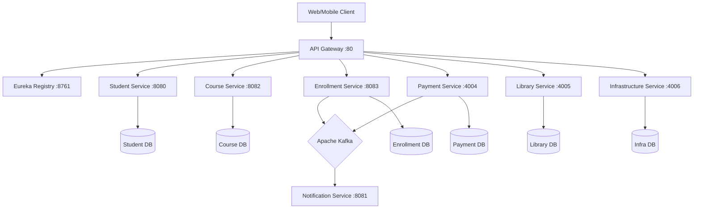

# 🎓 Student Management System - Backend


An enterprise-grade, scalable **Microservices Architecture** for managing university operations. Built with modern Java standards, this system leverages **Spring Cloud** for orchestration, **Apache Kafka** for asynchronous event-driven communication, and **Spring Cloud Gateway** for intelligent routing and load balancing.

---

## 🏗️ Architecture Overview

The system is decomposed into loosely coupled services, each responsible for a specific domain. It uses **Eureka** for service discovery and an **API Gateway** as the single entry point.

### System Topology


---

## ⚖️ Load Balancing Strategy

This architecture implements **Client-Side Load Balancing** using Spring Cloud Gateway and Netflix Eureka.

1.  **Service Registration**: All microservices (Student, Course, Payment, etc.) register themselves with the **Eureka Naming Server** upon startup.
2.  **Dynamic Routing**: The **API Gateway** queries Eureka to get the list of available instances for a requested service.
3.  **Load Distribution**: The Gateway uses `Spring Cloud LoadBalancer` to distribute incoming traffic across available instances (e.g., Round Robin).
    *   *Example*: If you scale the `Student Service` to 3 replicas, the Gateway automatically balances requests between them without client configuration.

---

## 🚀 Microservices Breakdown

| Service | Port | Tech Stack | Description |
| :--- | :--- | :--- | :--- |
| **Discovery Service** | `8761` | Netflix Eureka | Service registry and discovery server. |
| **API Gateway** | `80` | Spring Cloud Gateway | Unified entry point, routing, and load balancing. |
| **Student Service** | `8080` | Spring Data JPA | Manages student profiles and academic records. |
| **Course Service** | `8082` | Spring Data JPA | Handles course catalog, credits, and metadata. |
| **Enrollment Service** | `8083` | Spring WebClient, Kafka | Orchestrates course sign-ups and publishes events. |
| **Notification Service** | `8081` | Spring Kafka | Consumes events to send emails/alerts (Simulated). |
| **Payment Service** | `4004` | Spring Data JPA, Kafka | Handles billing, payment processing, and transaction history. |
| **Library Service** | `4005` | Spring Data JPA | Manages book inventory and lending operations. |
| **Infrastructure Service** | `4006` | Spring Data JPA | Manages classrooms, labs, and facility resources. |

---

## 🛠️ Infrastructure & Technologies

- **Core Framework**: Spring Boot 3.x, Spring Cloud (2022.x)
- **Database**: PostgreSQL (Containerized per service or shared logic)
- **Messaging**: Apache Kafka & Zookeeper (Event-driven consistency)
- **Containerization**: Docker & Docker Compose
- **Build Tool**: Maven

---

## ⚡ Getting Started

### Prerequisites
- **Java 17+** Installed
- **Docker Desktop** running
- **Maven** (optional, wrapper included)

### 1. Clone the Repository
```bash
git clone https://github.com/parthibanktech/student-management-system-backend.git
cd student-management-system-backend
```

### 2. Build the Microservices
We have provided a convenience script to build all services.
```bash
# Windows
mvn clean install
# OR build individual services if needed
```

### 3. Start the Environment
Use Docker Compose to spin up infrastructure (Postgres, Kafka, Zookeeper) and all application services.

```bash
docker-compose up -d --build
```
> **Note**: It may take a few minutes for all services to register with Eureka. Access the Eureka Dashboard at `http://localhost:8761` to check status.

---

## 🔌 API Endpoints

All requests should be routed through the **API Gateway** running on port `80`.

| Domain | Method | Endpoint | Description |
| :--- | :--- | :--- | :--- |
| **Students** | `GET` | `/api/v1/students` | Get all students |
| | `POST` | `/api/v1/students` | Register a new student |
| **Courses** | `GET` | `/api/v1/courses` | List available courses |
| | `POST` | `/api/v1/courses` | Create a new course |
| **Enrollments** | `POST` | `/api/v1/enrollments` | Enroll a student (Trigger Notification) |
| **Payments** | `GET` | `/payments` | List all payment records |
| | `POST` | `/payments/{id}/complete` | Process a payment |
| **Library** | `GET` | `/library/books` | Browse library inventory |
| **Infrastructure** | `GET` | `/infrastructure/classrooms` | View available classrooms |

---

## ✅ Production Standards Implemented
- **Centralized Error Handling**: `@ControllerAdvice` used globally for consistent JSON error responses.
- **Asynchronous Processing**: High-throughput enrollment processing using Kafka.
- **Service Decoupling**: Services interact via REST (sync) and Kafka (async) to avoid tight coupling.
- **Environment Configuration**: Dockerized environment variables for seamless dev-to-prod transition.
- **Resilience**: Fault tolerance via Gateway timeouts and Eureka registry.
