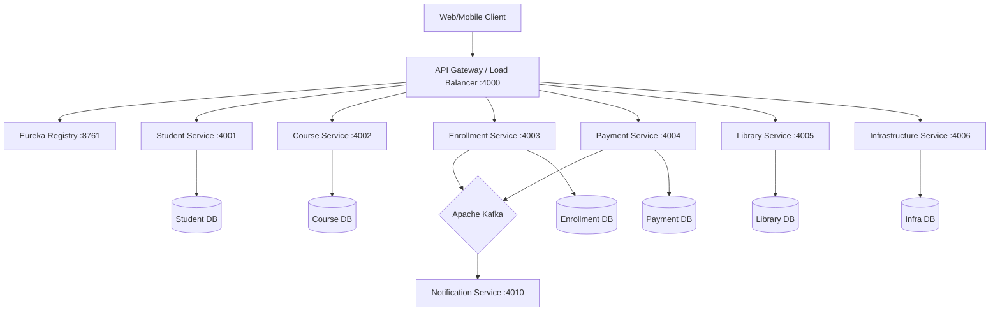

# 🎓 Student Management System - Backend


An enterprise-grade, scalable **Microservices Architecture** for managing university operations. Built with modern Java standards, this system leverages **Spring Cloud** for orchestration, **Apache Kafka** for asynchronous event-driven communication, and **Spring Cloud Gateway** for intelligent routing and load balancing.

---

## 🏗️ Architecture Overview

The system is decomposed into loosely coupled services, each responsible for a specific domain. It uses **Eureka** for service discovery and an **API Gateway** as the single entry point.

### System Topology


---

## ⚖️ Load Balancing Strategy

This architecture implements **Client-Side Load Balancing** using Spring Cloud Gateway and Netflix Eureka.

1.  **Service Registration**: All microservices (Student, Course, Payment, etc.) register themselves with the **Eureka Naming Server** upon startup.
2.  **Dynamic Routing**: The **API Gateway** queries Eureka to get the list of available instances for a requested service.
3.  **Load Distribution**: The Gateway uses `Spring Cloud LoadBalancer` to distribute incoming traffic across available instances (e.g., Round Robin).
    *   *Example*: If you scale the `Student Service` to 3 replicas, the Gateway automatically balances requests between them without client configuration.

---

## 🚀 Microservices Breakdown

| Service | Port | Tech Stack | Description |
| :--- | :--- | :--- | :--- |
| **Discovery Service** | `8761` | Netflix Eureka | Service registry and discovery server. |
| **API Gateway** | `4000` | Spring Cloud Gateway | Unified entry point, routing, and load balancing. |
| **Student Service** | `4001` | Spring Data JPA | Manages student profiles and academic records. |
| **Course Service** | `4002` | Spring Data JPA | Handles course catalog, credits, and metadata. |
| **Enrollment Service** | `4003` | Spring WebClient, Kafka | Orchestrates course sign-ups and publishes events. |
| **Payment Service** | `4004` | Spring Data JPA, Kafka | Handles billing, payment processing, and transaction history. |
| **Library Service** | `4005` | Spring Data JPA | Manages book inventory and lending operations. |
| **Infrastructure Service** | `4006` | Spring Data JPA | Manages classrooms, labs, and facility resources. |
| **Notification Service** | `4010` | Spring Kafka | Consumes events to send emails/alerts (Simulated). |

---

## 🛠️ Infrastructure & Technologies

- **Core Framework**: Spring Boot 3.x, Spring Cloud (2022.x)
- **Database**: PostgreSQL (Containerized per service or shared logic)
- **Messaging**: Apache Kafka & Zookeeper (Event-driven consistency)
- **Containerization**: Docker & Docker Compose
- **Build Tool**: Maven

---

## ⚡ Getting Started

### Prerequisites
- **Java 17+** Installed
- **Docker Desktop** running
- **Maven** (optional, wrapper included)

### 1. Clone the Repository
```bash
git clone https://github.com/parthibanktech/student-management-system-backend.git
cd student-management-system-backend
```

### 2. Build the Microservices
We have provided a convenience script to build all services.
```bash
# Windows
mvn clean install
# OR build individual services if needed
```

### 3. Start the Environment
Use Docker Compose to spin up infrastructure (Postgres, Kafka, Zookeeper) and all application services.

```bash
docker-compose up -d --build
```
> **Note**: It may take a few minutes for all services to register with Eureka. Access the Eureka Dashboard at `http://localhost:8761` to check status.

---

## 🔌 API Endpoints

All requests should be routed through the **API Gateway** running on port `4000`.

| Domain | Method | Endpoint | Description |
| :--- | :--- | :--- | :--- |
| **Students** | `GET` | `/api/v1/students` | Get all students |
| | `POST` | `/api/v1/students` | Register a new student |
| **Courses** | `GET` | `/api/v1/courses` | List available courses |
| | `POST` | `/api/v1/courses` | Create a new course |
| **Enrollments** | `POST` | `/api/v1/enrollments` | Enroll a student (Trigger Notification) |
| **Payments** | `GET` | `/payments` | List all payment records |
| | `POST` | `/payments/{id}/complete` | Process a payment |
| **Library** | `GET` | `/library/books` | Browse library inventory |
| **Infrastructure** | `GET` | `/infrastructure/classrooms` | View available classrooms |

---

## ✅ Production Standards Implemented
- **Centralized Error Handling**: `@ControllerAdvice` used globally for consistent JSON error responses.
- **Asynchronous Processing**: High-throughput enrollment processing using Kafka.
- **Service Decoupling**: Services interact via REST (sync) and Kafka (async) to avoid tight coupling.
- **Environment Configuration**: Dockerized environment variables for seamless dev-to-prod transition.
- **Resilience**: Fault tolerance via Gateway timeouts and Eureka registry.

---

## 🔒 Production Deployment & Security

### Dynamic Scaling
In the `prod` profile, all microservices are configured with `server.port: 0`. This enables **Operating System level random port allocation**, allowing you to run multiple instances of the same service on a single node without port conflicts.

### AWS / Cloud Security
Since services run on random ports, **you do NOT need to open these ports to the public internet**.

*   **Public Access**: Open ONLY ports `80` (HTTP) and `443` (HTTPS) for the **API Gateway**.
*   **Internal Access**: Configure your AWS **Security Group** to allow "All TCP" traffic **only from within the VPC CIDR block** (e.g., `10.0.0.0/16`).
    *   This allows the Gateway to talk to Microservices, and Microservices to talk to each other (and Eureka) on ANY ephemeral port.
    *   **Result**: The outside world can ONLY access your app via the Secure API Gateway.

---

## 🐛 Troubleshooting & Deployment Issues

Here is a summary of real-world errors encountered during the AWS Deployment and how they were resolved. This is useful for interview discussions on debugging and DevOps.

### 1. `service "nginx" refers to undefined network`
*   **Problem**: Docker Compose failed with an "invalid compose project" error.
*   **Cause**: The `docker-compose.yml` file had a duplicate `driver: bridge` key in the `networks` configuration, making the YAML invalid.
*   **Resolution**: Cleaned up the `networks` section to remove the duplicate line.

### 2. `Connection Refused` on Browser (Public IP)
*   **Problem**: The application was deployed, but the browser could not connect to the EC2 Public IP.
*   **Cause**: Nginx was listening on port `4000` (mapped `4000:80` in Compose), but browsers default to port `80`.
*   **Resolution**: Changed Nginx port mapping to `80:80` in `docker-compose.yml` so it accepts standard HTTP traffic.

### 3. `failed to solve: lstat /target: no such file`
*   **Problem**: Deployment failed during the `docker build` step on EC2.
*   **Cause**: The GitHub repository does NOT contain the `/target` folder (it's ignored). When building on EC2, the `COPY target/*.jar` instruction failed because the JARs didn't exist there.
*   **Resolution**: Switched to using **Pre-built Docker Images**. Instead of building on the server, we build images in GitHub Actions, push to Docker Hub, and simply `pull` them on EC2 (`image: ...` instead of `build: ...`).

### 4. `No such image: studentmgmt/...`
*   **Problem**: Docker Compose couldn't find the images to pull.
*   **Cause**: The `docker-compose.yml` defaulted to the user `studentmgmt` (`${DOCKERHUB_USERNAME:-studentmgmt}`), but our CI/CD pipeline pushed images to `parthibanktech3`.
*   **Resolution**: Updated `docker-compose.yml` variables to default to `parthibanktech3` to match the registry.

### 5. `no main manifest attribute, in app.jar`
*   **Problem**: Containers started but immediately crashed. Logs showed "no main manifest attribute".
*   **Cause**: The JAR files were built without the `spring-boot-maven-plugin`. This meant they were standard library JARs, not **executable** Spring Boot JARs (which require a specific `MANIFEST.MF` entry).
*   **Resolution**: Added `<build><plugins><plugin>spring-boot-maven-plugin...</plugin>...</plugins></build>` to the parent `pom.xml` and triggered a rebuild.

### 6. `Bind for 0.0.0.0:4006 failed: port is already allocated`
*   **Problem**: One of the services (`notification-service`) failed to start.
*   **Cause**: Port Conflict. Both `notification-service` and `infrastructure-service` were configured to use host port `4006` in `docker-compose.yml`.
*   **Resolution**: Changed `infrastructure-service` host port mapping to `4007:4006`.
